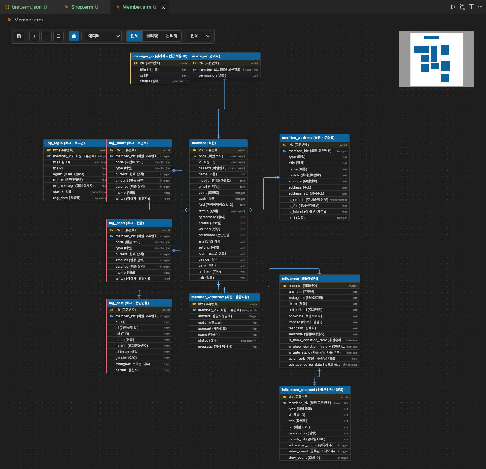
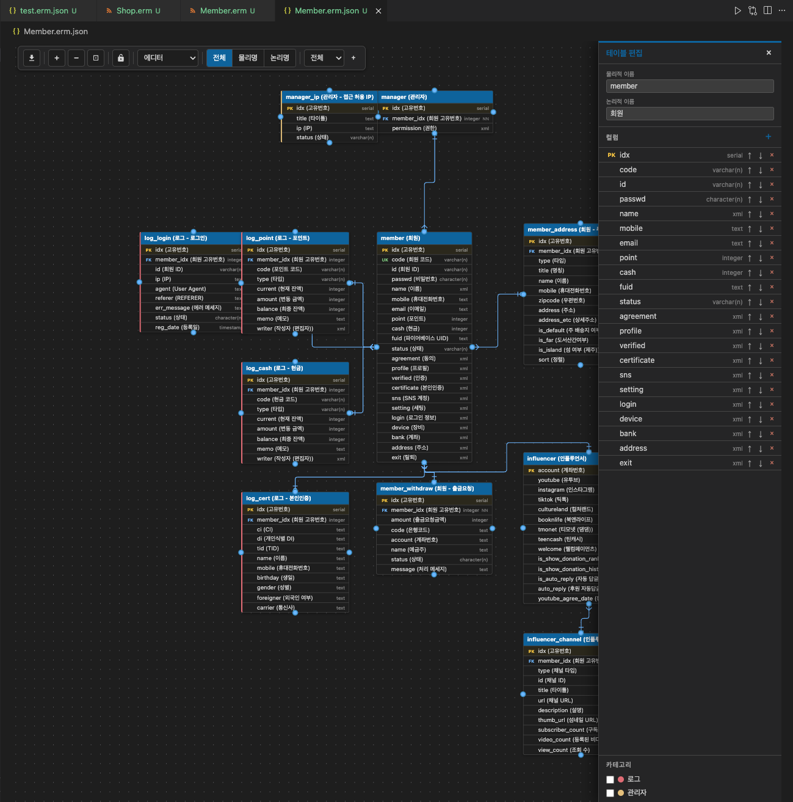
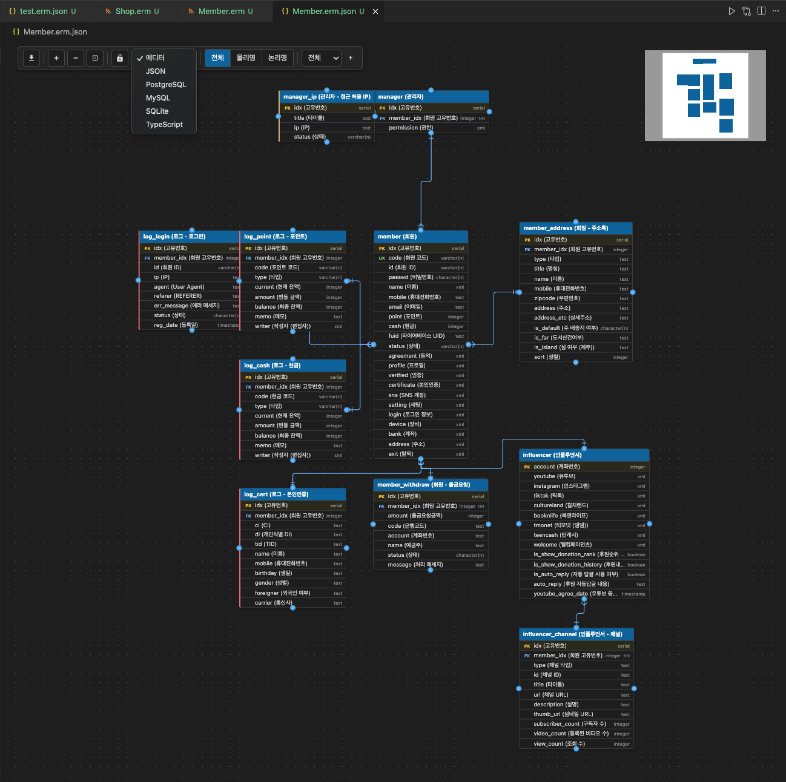

# ERManager

[](https://marketplace.visualstudio.com/items?itemName=addios4u.ermanager)
[](https://marketplace.visualstudio.com/items?itemName=addios4u.ermanager)
[](https://marketplace.visualstudio.com/items?itemName=addios4u.ermanager)
[](https://marketplace.visualstudio.com/items?itemName=addios4u.ermanager)

**ERManager** is a VS Code / Cursor extension for designing and editing database ER diagrams directly inside your editor.

Open `.erm.json` files as a visual diagram editor, or view legacy ERMaster `.erm` files as read-only diagrams — no external tools required.



---

## Features

### Visual ER Diagram Editor
- Drag-and-drop canvas powered by [React Flow](https://reactflow.dev/)
- Pan, zoom, minimap for large schemas
- Layout lock / unlock to prevent accidental moves
- Auto-fit view on open

### Table & Column Management



- Add / rename / delete tables via right-click context menu
- Edit columns: physical name, logical name, data type, description
- Column constraints: Primary Key, Foreign Key, Not Null, Unique, Default value

### Relationships
- Draw relationships by dragging between tables
- Auto-creates FK column in the source table
- Set cardinality per relation: `1`, `0..1`, `0..n`, `1..n`
- Delete relations via right-click menu (FK column reverts to a regular column)

### Categories
- Group tables into named categories with color labels
- Filter the diagram view by category

### View Modes
| Mode | Shows |
|------|-------|
| Full | Physical name + logical name + all columns |
| Physical | Physical names only |
| Logical | Logical names only |

### Code Export



Generate ready-to-use code from your diagram:

| Output | Description |
|--------|-------------|
| **PostgreSQL** | `CREATE TABLE` DDL |
| **MySQL** | `CREATE TABLE` DDL |
| **SQLite** | `CREATE TABLE` DDL |
| **TypeScript** | Interface / type definitions |
| **JSON** | Raw schema (editable, applies back to diagram) |

FK constraints can be toggled on/off for SQL output.

### SQL Import
Import existing `.sql` / `.ddl` files to generate tables automatically.

### Legacy `.erm` File Support
View and convert ERMaster XML (`.erm`) files — export them to `.erm.json` + `.erm.layout.json` with one click.

---

## File Formats

| File | Purpose | Commit to Git? |
|------|---------|----------------|
| `*.erm.json` | Schema — tables, columns, relations, categories | ✅ Yes |
| `*.erm.layout.json` | Diagram layout — positions and sizes | Team decision |
| `*.erm` | Legacy ERMaster XML (read-only in ERManager) | ✅ Yes |

---

## Getting Started

1. Install **ERManager** from the VS Code Marketplace.
2. **New diagram** — Create a new file named `yourschema.erm.json`. ERManager opens it automatically as a blank diagram editor.
3. Right-click on the canvas to add a table.
4. Drag from a table handle to another table to create a relationship.

> **Migrating from ERMaster?** Open your `.erm` file, click the save button to generate `.erm.json`, then open it for full editing. See [Viewer Mode](#viewer-mode-erm) for details.

---

## Usage

### Editor Mode (`*.erm.json`)
Full editing capabilities are available.

- **Add table** — right-click on canvas → *Add Table*
- **Edit table** — click a table to open the edit panel on the right
- **Delete table** — right-click a table → *Delete Table*
- **Add relation** — drag from the edge handle of one table to another
- **Edit relation** — right-click an edge to change cardinality or delete
- **Import SQL** — toolbar *Import SQL* button, select a `.sql` or `.ddl` file
- **Export code** — toolbar dropdown: select PostgreSQL / MySQL / SQLite / TypeScript / JSON

### Viewer Mode (`*.erm`)
Read-only visualization of legacy ERMaster files.

- **Export to JSON** — toolbar save button converts to `.erm.json` + `.erm.layout.json`

> **Workflow: migrating from ERMaster**
> 1. Open your `.erm` file — ERManager displays it as a read-only diagram
> 2. Click the **save** button in the toolbar to export
> 3. Two files are generated: `yourfile.erm.json` (schema) and `yourfile.erm.layout.json` (layout)
> 4. Open `yourfile.erm.json` — full editing is now available

---

## Development

```bash
# Install dependencies
pnpm install

# Build (extension + webview)
pnpm compile

# Watch mode
pnpm watch

# Lint
pnpm lint

# Package .vsix
pnpm package
```

Press **F5** in VS Code to launch the Extension Development Host.
The `test-fixtures/` folder opens automatically — use `sample.erm.json` to test the editor.

### Tech Stack

| Layer | Technology |
|-------|-----------|
| Extension host | TypeScript + VS Code Extension API |
| Webview UI | React 18 + React Flow (`@xyflow/react` v12) |
| Code editor | Monaco Editor |
| Build | esbuild |

---

## Support

If you find ERManager useful, consider buying me a coffee!

[](https://buymeacoffee.com/addios4u)

---

## License

MIT
